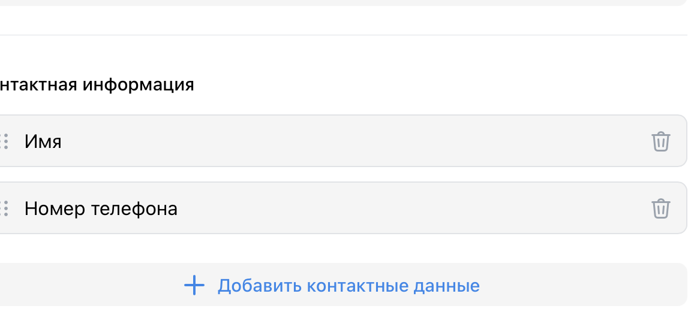

# Чек лист команды Гигачады.

## Содержание:
- Сайты
- Мобильные приложения
- Лид-формы и опросы

# Сайты

URL: https://ads.vk.com/hq/pixels

После перехода на вкладку сайтов, выводится панель управления пикселями, которая позволяет создавать и настраивать пиксели для отслеживания конверсий на сайте. 

1. При нажатии на кнопку "Добавить пиксель" открывается модальное окно с формой добавления нового пикселя. 

2. Форма содержит два раздела для работы с пикселями:

## Домен сайта

Действия с модальным окном:
- Закрытие окна происходит при:
  - Нажатии на крестик в правом верхнем углу
  - Клике вне области модального окна
  

Работа с формой:
- Поле "Домен сайта":
  - До заполнения поля кнопка "Добавить пиксель" неактивна
  
  - При вводе некорректного URL появляется предупреждение об ошибке
  
  - При вводе несуществующего сайта появляется предупреждение об отсутствии сайта
    
    

  - После ввода корректного URL кнопка становится активной
    

Процесс создания:
- После успешного создания пикселя:
  - Отображается уведомление об успешном создании
  - Становится доступна кнопка "Получить код"
        

- При нажатии "Получить код":
  - Открывается новая вкладка
  - На странице отображается:
    - Ссылка на добавленный сайт,
    - Ползунки:
        1. Автоматический поиск событий
        2. Сбор событий из слоя данных
        3.  Синхронизация пользователей
    - Код для установки пикселя
    

## ID пикселя

Работа с формой:
- Обязательные поля:
  - ID пикселя
  - Email владельца
    

- Валидация данных:
  - Кнопка "Запросить доступ" активируется только при заполнении обоих полей
      
  - При вводе некорректного email появляется сообщение об ошибке

      
  - При вводе ранее запрошенного счетчика, возникает окно об ошибке в левом углу странице
      
   - При воводе некорректного счетчика появляется сообщение об ошибки 
      
  - После ввода корректных данных можно запросить доступ

## Поиск и управление пикселями

- Основное окно управления пикселями - отображает список всех созданных пикселей с возможностью фильтрации и поиска

- При вводе некорректного названия пикселя в поиске отображается пустой результат

- При вводе корректного названия пикселя отображаются все соответствующие результаты

- В переходе в настройки пикселем отображаются 6 разделов:
    1. События

    URL: https://ads.vk.ru/hq/pixels/3646103/events
    
    При нажатии на кнопку "Добавить событие" открывается модальное окно с формой добавления нового события. 
    
    - Поля для заполнения:
      - Название события
      - Категория
    - Кнопки управления:
      - Выбор типа настройки события (вручную и в визуальном конструкторе)
      - "Отмена" - закрывает модальное окно без сохранения
      - "Добавить" - создает новое событие
    - Закрытие окна:
      - По клику вне области модального окна
    При заполнении поля Категории, всплывает окно выбора нужной категории
     После выбора Категории, возникает поле "Условие наступления"
    
    При вводе некорректного URL появляется предупреждение об ошибке
    
    После ввода полей кнопка "Добавить событие" становится активной
    
    После создания события отображается страница со списком событий:
    

    Интерфейс страницы событий:
    - Верхняя панель:
      - Кнопка "Добавить событие" для создания новых событий
      - Поле поиска для фильтрации событий
      - Ссылка "Как настроить офлайн-события" со справочной информацией
    - Таблица событий с колонками:
      - ID (с возможностью сортировки)
      - Категория и Название
      - Условие (с иконкой подсказки)
      - Ценность (с иконкой подсказки)
      - Событий за 7 дней
    - Разделы событий:
      - События визуального конструктора (с иконкой подсказки)
      - Автоматически найденные события (с иконкой подсказки)

    2. Код пикселя

    URL: https://ads.vk.ru/hq/pixels/3646103/code

    На странице отображается:
    - Ссылка на добавленный сайт,
    - Ползунки:
        1. Автоматический поиск событий
        2. Сбор событий из слоя данных
        3.  Синхронизация пользователей
    - Код для установки пикселя
    
    3. Аудитория сайта

    - URL: https://ads.vk.ru/hq/pixels/3646103/portrait

    - Отображается сообщение "Недостаточно посетителей сайта"
    - Под сообщением указано условие: "Запросить портрет аудитории можно, если сайт посетило от 1000 пользователей за неделю"
    - Кнопка "Запросить":
      - Неактивна, если количество посетителей меньше 1000 за неделю
      - Становится активной только при достижении порога в 1000 уникальных посетителей за неделю
     
    4. Аудиторные теги

    - URL: https://ads.vk.ru/hq/pixels/3646103/tags
    - В верхней части отображается информационный блок с описанием функционала:
    - При отсутствии тегов отображается сообщение "Нет аудиторных тегов"
    - Кнопка "Создать аудиторный тег" открывает модальное окно создания нового тега
    

    При нажатии на кнопку "Создать аудиторный тег" открывается модальное окно:
    
    - Заголовок "Новый аудиторный тег"
    - Поле "Введите название тега"
    - Кнопки управления:
      - "Отмена" - закрывает модальное окно
      - "Создать" - создает новый тег 
    - Окно можно закрыть, нажав на крестик в правом верхнем углу
    

    После создания тега отображается страница со списком аудиторных тегов:
    
    Интерфейс страницы аудиторных тегов:
    - Таблица тегов с колонками:
      - Название 
      - Статус 
      - Охват 
      - Сегменты
      - Действия (кнопка "Копировать", "Посмотреть код" в виде всплывающей подсказки)
  
    5. Доступы

    URL:https://ads.vk.ru/hq/pixels/3646103/pixel_access
    

    

    Раздел "Доступы":
    - При первом входе отображается пустое состояние:
      - Заголовок "Вы пока не выдали ни одного доступа"
      - Описание функционала: 
      - Кнопка "Выдать доступ"

    При нажатии на кнопку "Выдать доступ" открывается модальное окно:
    
    - Заголовок "Доступ к пикселю"
    - Поле "ID аккаунта, которому будет выдан доступ" 
    - Подсказка о правах доступа
    - Кнопки:
      - "Отмена" - закрывает модальное окно
      - "Выдать доступ" - подтверждает действие

    При вводе некорректного ID аккаунта:
    
    - Появляется сообщение об ошибке красным цветом
    - Кнопка "Выдать доступ" остается активной

    6. Диагностика сайта 

    URL: https://ads.vk.ru/hq/pixels/3646103/review

    

    Раздел "Диагностика сайта":
    - При первом входе отображается начальное состояние:
      - Заголовок "Диагностика ещё не проводилась"
      - Описание
      - Кнопка "Проверить сайт"

    При нажатии на кнопку "Проверить сайт" отображается процесс диагностики:
    
    - Заголовок "Проверяем сайт"
    - Статус
    - Отображается анимированная иконка процесса проверки

# Мобильные приложения

Начальная страница:

- При первом входе отображается пустое состояние:
  - Заголовок "Нет привязанных приложений"
  - Описание
  - Кнопка "Добавить приложение"

При нажатии на кнопку "Добавить приложение" открывается модальное окно:

- Заголовок "Привязка приложения"
- Поля для заполнения:
  - Ссылка на приложение
- Кнопки:
  - "Добавить" - создает новую приаязку приложения

При вводе некорректных данных:

- Отображается сообщение об ошибке
- Кнопка "Добавить" становится неактивной

Страница привязки приложения:

- Заголовок "Привязка приложения"
- Отображается информация о выбранном приложении
- Ссылка на справку "Как настроить приложение в трекере"
- Поле с кодом привязки
- Кнопка "Копировать"

После копирования кода:

- Кнопка "Копировать" меняет состояние на "Скопировано"
- Код остается видимым в поле

После успешной привязки приложение отображается в списке:

- Таблица с колонками:
  - Название приложения
  - Категория 
  - Название трекера 
  - Статус
- Внизу отображается итоговая информация: "Итого: 1 приложение"

# Лид-формы и опросы

URL: https://ads.vk.ru/hq/leadads/leadforms

## Лид-формы

- При переходе в раздел "Лид-формы" отображается список всех созданных форм или сообщение о том, что форм пока нет, с кнопкой "Создать лид-форму".

### Шаг 1. Оформление

- При нажатии на кнопку "Создать лид-форму" открывается окно создания новой формы.
- В окне отображаются обязательные поля:
  - Логотип (с возможностью загрузить или заменить)
  - Название компании
  - Заголовок формы
  - Описание формы
- Можно выбрать цветовую схему оформления.
- В правой части окна отображается предпросмотр внешнего вида формы.
- Кнопка "Продолжить" активна

- Переход на "Вопросы" становится возможным только после заполнения всех обязательных полей.

- При нажатии на "Вопросы" происходит переход к следующему шагу.

### Шаг 2. Вопросы

- При успешном заполнении полей можно продолжить
- Основные элементы:
  - Выбор стилей (палитра цветов)
  - Выбор логотипа (с опциями кадрировать, заменить)
  - Кнопка "Продолжить" активна
  - Кнопка "Отмена" для отмены создания
  - Можно добавить или удалить контактную информацию
  

### Шаг 3. Результат

Окно создания вопроса:

- Структура вопроса:
  - Заголовок "Вопрос № 1" (с возможностью удаления)
  - Поле для текста вопроса
  - Выбор типа вопроса: "Выбор одного ответа"
  - Варианты ответов:
  - Кнопка "Добавить ответ"
  - Опция "Ответ из шаблона"
- Кнопка "Добавить вопрос" внизу страницы

### Шаг 4. Настройки

- На этом шаге доступны:
  - Настройки уведомлений (отправка на email, в VK Messenger)
  - Включение обязательных вопросов
  - Согласие на обработку персональных данных (с обязательными полями)
- В правой части окна отображается предпросмотр итогового экрана формы.
- Кнопка "Сохранить" становится активной после заполнения всех обязательных полей.
- Кнопка "Назад" возвращает к предыдущему шагу.

### После создания формы

- Форма появляется в общем списке лид-форм.
- В таблице отображаются:
  - Название формы
  - Дата создания
  - Статус
  - Количество ответов
- Доступен поиск, фильтрация и создание новых форм.

## Формы YCLIENTS

https://ads.vk.ru/hq/leadads/yclients

- Верхняя панель с разделами:
  - Лид-формы
  - Формы YCLIENTS (активный)
  - Опросы
- При переходе в раздел "Формы YCLIENTS":
  - Отображается заголовок "Продвигайте формы онлайн-записи через VK Рекламу"
  - Указано "Всего в 2 шага"
  - Шаг 1 "Подключите YCLIENTS": 
    - Описание "В разделе интеграций YCLIENTS найдите VK Рекламу и нажмите «Подключить»"
    - Кнопка "Перейти в YCLIENTS"
  - Шаг 2 "Вставьте код":
    - Описание "Скопируйте код из YCLIENTS и вставьте сюда"
    - Поле для ввода кода
    - Кнопка для отправки кода

## Опросы

- При переходе в раздел "Опросы":
  - При отсутствии созданных опросов отображается сообщение "У вас пока нет опросов"
  - Описание: "Используйте опросы, чтобы собирать мнения и обратную связь от клиентов или провести исследование рынка"
  - Кнопка "Создать опрос" для создания нового опроса
- При нажатии на кнопку "Создать опрос" открывается окно создания нового опроса.

### Шаг 1. Оформление

- В окне отображаются обязательные поля:
  - Название опроса
  - Логотип (с возможностью загрузить или заменить)
  - Название компании
  - Заголовок опроса
  - Описание опроса
- Можно выбрать цветовую схему оформления.
- В правой части окна отображается предпросмотр внешнего вида опроса.
- Кнопка "Вопросы" становится активной только после заполнения всех обязательных полей.
- При нажатии на "Вопросы" происходит переход к следующему шагу.

### Шаг 2. Вопросы

- В верхней части окна отображается прогресс по шагам: Оформление — Вопросы — Результат.
- Можно добавить вопросы к опросу:
  - Для каждого вопроса выбирается тип (например, "Один из списка").
  - Добавляются варианты ответов.
  - Можно использовать шаблонные ответы ("Другое", "Ничего из перечисленного", "Затрудняюсь ответить", "Свой вариант").
- Доступна кнопка "Добавить вопрос" для создания дополнительных вопросов.
- Можно добавить стоп-экран.
- Кнопка "Результат" становится активной после добавления хотя бы одного вопроса.
- Кнопка "Назад" возвращает к предыдущему шагу.

### Шаг 3. Результат

- На этом шаге настраивается страница благодарности:
  - Поля "Заголовок" и "Описание" (например, "Спасибо за ответы!", "Заявка отправлена").
  - Можно добавить ссылку.
- В правой части окна отображается предпросмотр итогового экрана.
- Кнопка "Запустить опрос" становится активной после заполнения всех обязательных полей.
- Кнопка "Назад" возвращает к редактированию вопросов.

### После запуска опроса

- Опрос появляется в общем списке опросов.
- В таблице отображаются:
  - Название опроса
  - Статус (например, "Активен")
  - Количество анкет
  - Дата создания
  - ID опроса
- Доступен поиск, фильтрация и создание новых опросов.

